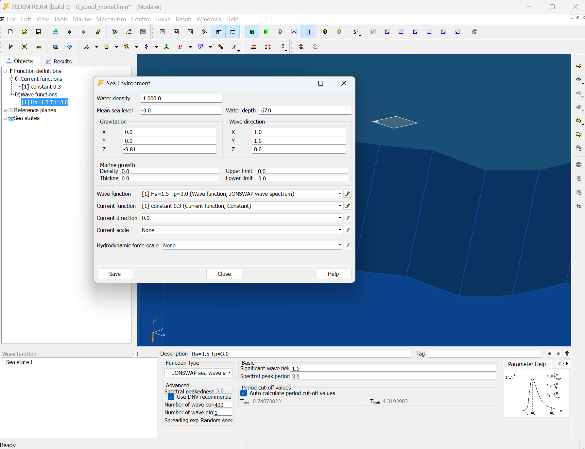

# README - Subsea Spool Installation

## How to run
The below procedure is made in order to demonstrate various features. For real engineering analysis please 
adjust the procedure in accordance with your needs 

### Make initial model
An template FEDEM modelfile `0_spool_model.fmm` is made and prepared with a predefined results set and
a sea environment.

_NOTE: The sea environment is not yet made available through the `fedempy`. Please reach out to the community
if such capability is needed_ 

### Make the spool model
The spool model is now made using `fedempy`.  

The script `a_make_spool_model.py` uses `0_spool_model.fmm` as a template and appends the 
required model items.  The script saves the model into `1_spool_model.fmm`

### Run the model, version 1
The `1_spool_model.fmm` modelfile can now be opened in `FEDEM` for further modifications 
and execution.  In this demonstration the modelfile will be run using the `fedempy` capability.

The script `b_spool_solution.py` runs the modelfile.  To evaluate the results open the 
modelfile in `FEDEM`

### Run the model, version 2
The script `c_spool_solution.py` uses the same modelfile `1_spool_model.fmm` is used, but now `fedempy` is used to control
simulation and extract requested results. 

The script `b_spool_solution.py` runs the modelfile.  To evaluate the results open the 
modelfile in `FEDEM`

